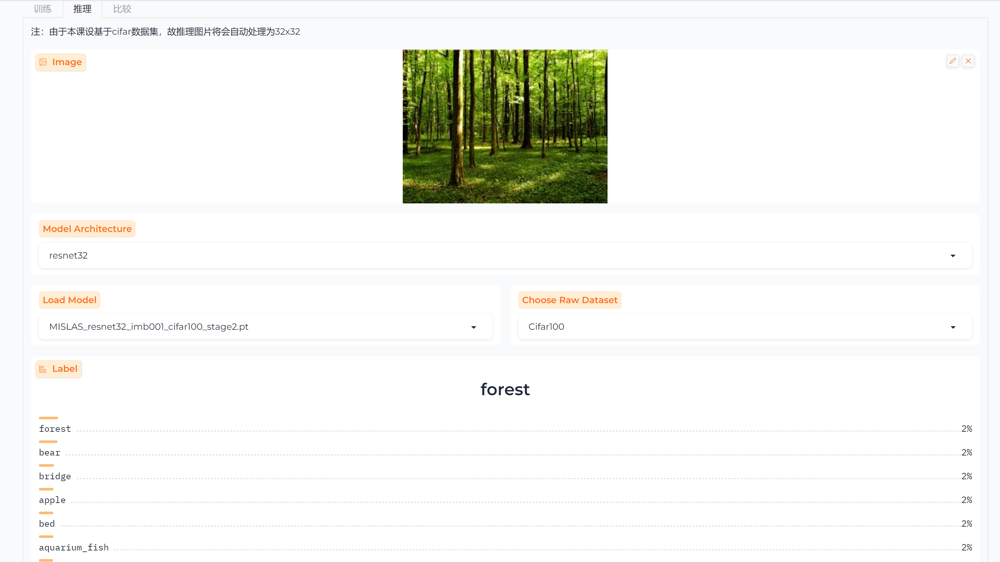

## 1. 环境

建议使用anaconda，确保anaconda安装文件夹路径不含**中文&空格**以及项目文件夹路径不含**中文&空格**后，**依次**执行

```
conda create -n ML python==3.10
conda activate ML
```

部分用户在执行 `conda activate ML` 时候会出现需要`conda init` 的提示，此时请使用如下类似命令

* `conda init --all`
* `conda init cmd.exe`

然后，终端使用 `cd` 命令切换工作文件夹至工作目录， 下载 python 所需的依赖库

```
pip install -r requirements.txt
```

> 请确保项目文件夹所在磁盘内存足够


## 2. 项目介绍


### 2.1 项目目标

本项目受 [论文](https://arxiv.org/abs/2303.03630) 启发，在 cifar100 数据集上比较以下模型的表现效果

* 简单方法
  * CE & BSCE
* 前人的改进方法
  * LDAM & LADE & MiSLAS & RIDE & Paco
* 论文作者提出的 GML tuning 策略以及 ensemble trick方法
  * CE + GML & CE + GML(emsemble)

> 由于团队科研能力有限，只能对基于基础的残差神经网络架构方法进行再现，所以这里使用简单的 CE 方法来再现论文提出的 GML 损失函数的 Plug-In Method 对于预训练模型的改善效果


### 2.2 文件介绍

**Paco**, **RIDE-LongTailRecgnition** : 这两个文件夹存储的是对应模型的代码 (由于这个并非我们项目的主体文件，不做过多介绍)

```
- app.py : 项目的主体入口，运行该文件可以进入 webui 界面
- train.py : 训练模型 & 测试模型
- requirements.txt : Python 依赖
- utils.py : 存储统计模型评价 metric 的函数
- loss.py : 存储各种需要用到的损失函数
- models : 
	- pretrained : 预训练模型
	- resnet.py : 存储残差神经网络代码
- datasets :
	- dataset.py : 下载 cifar10/cifar100，并处理为不平衡的数据集
	- sampler.py : 附加的功能，提供了另外一些 Long-tail learning 的方法
- Trained_Model : 存储训练后模型的文件夹
```


### 2.3 使用说明

> 经测试，我们的代码既可以单独在 cpu 上运行，也可以单独在 gpu 上运行

我们借由 UI 界面，介绍具体的使用细节，使用终端 `python app.py` or IDE 运行 app.py 文件，然后点击弹出的网址。


网页上会显示3个tab，训练，推理，比较，接下来介绍一下三个页面

#### (1).  训练


**数据集**

| 参数             | 作用                                                      |
| ---------------- | --------------------------------------------------------- |
| Dataset          | 训练使用的数据集                                          |
| Imbalance Factor | #所含样本最少的类别的样本数 / #所含样本最多的类别的样本数 |
| Data Path        | 存储数据集的位置，不建议修改默认值                        |


**IF值 & re-weight_re-sample策略** 

| 参数           | 作用                                                   |
| -------------- | ------------------------------------------------------ |
| Imbalance Type | 将平衡的cifar-10/cifar-100打乱为不平衡数据集的方式     |
| Train Rule     | 另外的一些长尾学习的方法，如 re-weighting, re-sampling |


**预训练 & 集成模型参数设置**

| 参数                                    | 作用                                                      |
| --------------------------------------- | --------------------------------------------------------- |
| Pretrained(Freezing feature extraction) | 确认是否使用预训练模型，但是仅冻结其特征提取网络          |
| Pretrained(Freezing all parameters)     | 确认是否使用预训练模型，但是冻结其所有参数                |
| Ensemble                                | 确认是否采取作者提出的 ensemble 的 trick                  |
| Select Pretrained Model                 | 从 ”./models/pretrained“ 文件夹下获取当前已有的预训练模型 |
| Temperature for New Model               | 作者提出的 ensemble trick 的 t1 参数                      |
| Temperature for Old Model               | 作者提出的 ensemnle trick 的 t2 参数                      |


**其他参数**

| 参数              | 作用                                                     |
| ----------------- | -------------------------------------------------------- |
| Seed              | 用于设置随机数种子(seed)以确保在训练过程中的随机性可重现 |
| Root Log          | 保存训练过程的日志                                       |
| Experiment String | 表示当前试验的编号                                       |


**训练参数**

| 参数        | 作用                            |
| ----------- | ------------------------------- |
| Start Epoch | 表示epoch 的开始编号            |
| Epochs      | 表示运行的 epoch 数             |
| Workers     | 表示用于加载数据的子进程数量    |
| Batch Size  | 表示一个训练/验证批次样本的数量 |


**模型参数**

| 参数               | 作用                     |
| ------------------ | ------------------------ |
| Momentum           | 表示 SGD 的动量参数      |
| Model Architecture | 表示训练时使用的模型架构 |
| Weight Decay       | 控制 SGD 的权重衰减      |
| Loss Type          | 训练时使用的损失函数类别 |
| Learning Rate      | SGD 的学习率参数         |


**选项**

| 参数                                                  | 作用                         |
| ----------------------------------------------------- | ---------------------------- |
| save model(You can find it in 'Trained_model' folder) | 保存模型至 ”./Trained_model“ |


**输出**

输出每个 epoch 上在训练集 & 测试集上的四个 metric 上折线图

* precision&1 and GM
* HM & LR


#### (2). 推理

一个简单的应用模块，这并非是本项目的重点，所以略显粗糙

* Image : 上传待分类的图片
* Model Architecture : 选择用于推理的模型架构
* Load Model ： 加载已经预训练好的模型，注意**请与模型架构，以及模型原本的训练集对应**
  * **模型文件夹为** "./Trained_model"
* Choose Raw Dataset : 选择预训练模型所使用的数据集
* Label : 输出推理结果，即分类结果


> Ex ：效果虽然差强人意，但是合乎情理




#### (3). 比较

这个模块，我们实现了将预训练在选定数据集上使用指定损失函数进行 `fine-tuning` 的功能

* Dataset : 用于 `fine-tuning` 的数据集


**Imbalance 设置**

| 参数             | 作用                                                      |
| ---------------- | --------------------------------------------------------- |
| Imbalance Factor | #所含样本最少的类别的样本数 / #所含样本最多的类别的样本数 |
| Imbalance Type   | 将平衡的cifar-10/cifar-100打乱为不平衡数据集的方式        |


**Model 设置**

| 参数                    | 作用                                               |
| ----------------------- | -------------------------------------------------- |
| Model Architecture      | 预训练模型的架构                                   |
| Select Pretrained Model | 从 ”./models/pretrained“ 中加载预先训练模型        |
| Loss Type for Tuning    | Fine-tuning 使用的损失函数类型，默认是作者的 "GML" |
| Epochs                  | Fine-tuning 的训练论数                             |

**输出**

输出一组柱状图，分析新旧模型在100(cifar100)/10(cifar10)个类别上的准确率


### 2.4 细节


**1. 预处理模型的参数**

首先，我们的预处理模型只收集了网络架构的参数，其次您如果需要加载另外的预处理模型，请确保：

* 原先预处理模型的训练的 resnet 网络和本项目使用的网络基本相同
* 具体预处理模型的参数需要有类似：
  * conv1.weight
  * layer1.2.conv1.weight
  * layer2.4.bn1.running_var
  * linear.weight
  * linear.bias

> 在我们项目构建的过程中，发现有些模型文件里面的参数是 module.conv1.weight 或 fc.bias，这不代表该模型无法和本项目对应起来，您可以手动更改模型文件的**键值对**，从而使得您的模型适配我们的神经网络


**2. 关于运行该项目设备的说明**

本项目大部分代码在 cpu 设备上编写，并能够成功运转，但是训练速度十分缓慢，可以用于简单推理，同时我们又将仓库在 gpu 设备上运行并调整，使得其现在基本上是能在两种设备都可以运转


## 3. 使用


**使用 CE/BSCE/Focal/LaDe/FeaBal/LDAM 方法**

只需在 app.py 生成的 webui 上修改损失函数，并调整其他参数即可，如果您需要更详细的训练情况，可以查看 ”./log“


**使用 Paco 方法**

```markdown
cd ./Paco
```

使用 git bash 执行以下命令 (3选1)：

* `bash sh/CIFAR100_train_imb0.1.sh`
* `bash sh/CIFAR100_train_imb0.01.sh` (推荐)
* `bash sh/CIFAR100_train_imb0.02.sh`

如果您直接在 IDE 运行 `paco_cifar.py` 将会执行我们调整的默认配置，即使用 imb = 0.01 在CIFAR100 上运行

> 推荐使用第二条命令的原因是，我们准备的预训练模型训练使用的数据集 imb = 0.01


**使用 Ride 方法** 

```
cd ./RIDE-LongTailRecognition
```

终端运行(4 选 1)：

* `python train.py -c "configs/config_imbalance_cifar100_ride.json" -r "./pretrained/checkpoint-epoch5_ride.pth" --reduce_dimension 1 --num_experts 3`
* `python train.py -c "configs/config_imbalance_cifar100_ride_ea.json" -r "./pretrained/checkpoint-epoch5_ride_ea.pth" --reduce_dimension 1 --num_experts 3` (推荐)
* ``python train.py -c "configs/config_imbalance_cifar100_ride_teacher.json" -r "./pretrained/checkpoint-epoch200_ride_teacher.pth" --reduce_dimension 1 --num_experts 6``

> 如果，您需要更改 epoch 等参数，可以在上述命令的 json 文件中修改


## 4. 参考

* 本项目核心代码基于 [FBL](https://github.com/juyongjiang/fbl)
* Paco 来自仓库 [Parametric-Contrastive-Learning](https://github.com/dvlab-research/Parametric-Contrastive-Learning)，Ride 来自仓库 [RIDE-LongTailRecognition](https://github.com/frank-xwang/RIDE-LongTailRecognition)


